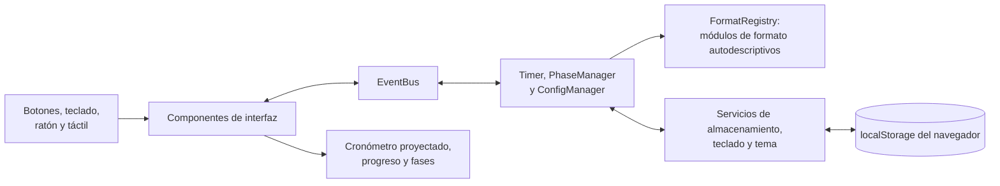

# Cronómetro de Debate ADA

[English version](README.md) | [Abrir aplicación](https://cronometro-ada.vercel.app/)

Cronómetro web optimizado para proyección, diseñado y desarrollado como proyecto personal para la **Asociación de Debate de Alicante (ADA)**. Incluye los formatos Académico y British Parliament, tiempos configurables, navegación entre fases, controles de teclado y persistencia local.

## Motivación

Una sesión de debate contiene muchas intervenciones con distintos participantes, duraciones y reglas. Un cronómetro genérico obliga a controlar la secuencia por separado y resulta difícil de leer cuando se proyecta en una sala.

El Cronómetro de Debate ADA combina el orden completo del debate con una cuenta atrás de gran formato. El operador puede configurar la sesión una vez, avanzar de forma segura entre sus fases y mantener visibles el participante actual y el tiempo restante.

## Funcionalidades

- **Dos formatos de debate:** Formato Académico configurable y British Parliament con ocho discursos.
- **Visualización para proyección:** cronómetro responsive de gran tamaño, participante actual, progreso y estado de las fases.
- **Control del exceso de tiempo:** la cuenta continúa en negativo cuando una intervención supera su duración.
- **Alertas visuales:** cambia a amarillo durante los últimos 10 segundos y a rojo después de 10 segundos de exceso.
- **Configuración flexible:** nombres de equipos, duración de discursos, número de refutaciones, última refutación reducida, deliberación y feedback.
- **Control de fases:** navegación anterior, siguiente y directa, desactivada durante la ejecución para evitar cambios accidentales.
- **Línea temporal interactiva:** permite ajustar la fase actual mediante clic, arrastre o interacción táctil sobre la barra de progreso.
- **Operación mediante teclado:** atajos para el cronómetro, navegación, configuración, selección de formato y tema.
- **Interfaz responsive:** diseñada para proyectores, portátiles, tablets y móviles.
- **Preferencias persistentes:** la configuración y el tema se guardan en el navegador mediante `localStorage`; no requiere cuenta ni backend.
- **Tema adaptativo:** modos claro y oscuro con detección de la preferencia del sistema.

## Formatos Disponibles

### Formato Académico

El Formato Académico genera la secuencia completa a partir de valores configurables:

1. Introducción del Equipo A y preguntas cruzadas.
2. Introducción del Equipo B y preguntas cruzadas.
3. Rondas de refutación alternadas para ambos equipos.
4. Conclusión del Equipo B seguida del Equipo A.
5. Deliberación de jueces y feedback.

Los valores predeterminados son introducciones de 4 minutos, preguntas cruzadas de 2 minutos, tres rondas de refutación de 5 minutos con una última ronda opcional de 90 segundos y conclusiones de 3 minutos.

### British Parliament

El formato British Parliament incluye los ocho discursos habituales:

1. Primer Ministro
2. Líder de la Oposición
3. Viceprimer Ministro
4. Vicelíder de la Oposición
5. Extensión de Gobierno
6. Extensión de la Oposición
7. Látigo de Gobierno
8. Látigo de la Oposición

La duración predeterminada de cada discurso es de 7 minutos. Se pueden configurar los nombres de los equipos de las cámaras alta y baja, tanto a favor como en contra. Tras los discursos se incluyen las fases de deliberación y feedback.

## Arquitectura

La aplicación utiliza módulos JavaScript sin framework. Los componentes de interfaz se comunican mediante un pequeño bus de eventos, manteniendo separados el motor del cronómetro, la generación de fases, el almacenamiento en el navegador y la actualización del DOM. Los formatos de debate son módulos autodescriptivos registrados en un `FormatRegistry`; el formulario de configuración, el selector de formato, los atajos de teclado y el panel de ayuda se generan a partir de él (ver [Añadir un Formato de Debate](#añadir-un-formato-de-debate)).



El cronómetro se sincroniza con marcas de tiempo del reloj real en lugar de contar intervalos, así que nunca se desvía cuando el navegador está ocupado o reduce la prioridad de la pestaña. El reloj se muestrea cada 200 ms y solo se emite un tick cuando cambia el segundo mostrado, de modo que un callback retrasado en una máquina lenta sigue mostrando todos los segundos en lugar de saltarse uno.

## Tecnologías

| Área | Tecnología |
| --- | --- |
| Aplicación | JavaScript Vanilla, módulos ES, HTML5 |
| Estilos | CSS modular, propiedades personalizadas y breakpoints responsive |
| Build | Vite 7 |
| Tests | Vitest 5 con jsdom (unitarios + integración) |
| Linting | ESLint 10 (flat config) |
| Persistencia | `localStorage` del navegador |
| Hosting | Vercel |
| Despliegue CI | Workflow de GitHub Actions para GitHub Pages |

## Estructura del Proyecto

```text
src/
|-- components/     # Cronómetro, controles, fases, configuración y tema
|-- core/           # Motor, gestor de fases, configuración y bus de eventos
|-- formats/        # Módulos de formato autodescriptivos + FormatRegistry
|-- services/       # Almacenamiento, atajos de teclado y preferencia de tema
|-- styles/         # Tokens de diseño, layout, componentes y responsive
`-- main.js         # Composición de la aplicación y conexión de eventos
tests/              # Tests unitarios con Vitest y un test de integración en jsdom
```

## Añadir un Formato de Debate

Los formatos son módulos autodescriptivos registrados en `src/formats/FormatRegistry.js`. El formulario de configuración, el selector de formato, el atajo de teclado y el panel de ayuda se generan a partir del registro, así que añadir un formato nunca modifica los componentes existentes.

1. Crea `src/formats/MiFormato.js` exportando un objeto con este contrato:

```js
export default {
  id: 'miformato',           // clave de configuración y data-format
  label: 'Mi Formato',       // se muestra en el selector y en la ayuda
  shortcut: '3',             // atajo de teclado opcional (debe ser único)
  defaults: { speechTime: 300, equipoA: 'Equipo A' },
  fields: [                  // genera la sección de configuración
    { key: 'speechTime', label: 'Discurso (seg)', type: 'number', step: 30, min: 0 },
    { key: 'equipoA', label: 'Equipo A', type: 'text', placeholder: 'Ej: Equipo A' },
    // también existe type: 'checkbox'; `showWhen: '<claveCheckbox>'` hace un campo condicional
  ],
  generatePhases(cfg) {      // recibe la configuración ya validada de este formato
    return [{ name: `Apertura (${cfg.equipoA})`, duration: cfg.speechTime }];
  },
};
```

2. Regístralo al final de `src/formats/FormatRegistry.js`:

```js
formatRegistry.register(MiFormato);
```

Las fases de deliberación y feedback se añaden automáticamente después de las fases del formato. Los valores se validan contra `fields` al cargar desde `localStorage` y al aplicar el formulario, de modo que `generatePhases` siempre recibe números y booleanos del tipo correcto.

## Comprobaciones de Calidad

```bash
npm run lint   # ESLint (flat config)
npm test       # Vitest: tests unitarios + test de integración en jsdom
npm run check  # ambos
```

## Controles de Teclado

Los controles se pueden desactivar desde el panel de configuración y se ignoran mientras el usuario escribe en un formulario.

<details>
<summary>Mostrar todos los atajos</summary>

| Tecla | Acción |
| --- | --- |
| `Espacio` | Iniciar, pausar o reanudar |
| `R` | Reiniciar la fase actual |
| `D` | Reiniciar el debate completo |
| `Izquierda` / `Derecha` | Fase anterior o siguiente |
| `Arriba` / `Abajo` | Sumar o restar 10 segundos |
| `+` / `-` | Sumar o restar 30 segundos |
| `,` / `.` | Sumar o restar 1 segundo |
| `C` | Abrir o cerrar la configuración |
| `F` | Abrir o cerrar la lista de fases |
| `1` / `2` | Seleccionar Formato Académico o British Parliament |
| `H` | Mostrar u ocultar la ayuda de teclado |
| `T` | Alternar entre modo claro y oscuro |
| `Enter` | Aplicar el formulario de configuración abierto |
| `Escape` | Cerrar los paneles abiertos |

</details>

## Ejecución Local

### Requisitos

- Node.js `20.19+` o `22.12+`
- npm

Instala las dependencias e inicia el servidor de desarrollo:

```bash
npm install
npm run dev
```

La aplicación se abre en [http://localhost:3000](http://localhost:3000).

Genera y previsualiza el build de producción:

```bash
npm run build
npm run preview
```

## Datos y Privacidad

La aplicación no tiene backend ni recopila datos de usuario. La configuración del debate y la preferencia de tema permanecen en el navegador actual. Al borrar los datos del sitio también se eliminan estas preferencias.

La aplicación desplegada carga sus recursos a través de Internet; la persistencia local significa que el uso no necesita registro ni una base de datos remota, no que sea una PWA instalable con funcionamiento offline.

## Despliegue

La aplicación de producción está alojada en Vercel:

**[cronometro-ada.vercel.app](https://cronometro-ada.vercel.app/)**

El repositorio también incluye un workflow de GitHub Actions que construye la aplicación Vite para GitHub Pages con cada push a `master`.

## Contexto

Este es un proyecto personal desarrollado para la [Asociación de Debate de Alicante](https://www.instagram.com/debatealicante/). Traduce necesidades reales de una sala de debate en una herramienta específica para participantes, jueces y organización de eventos.
